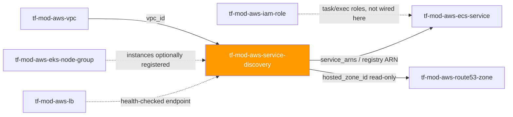
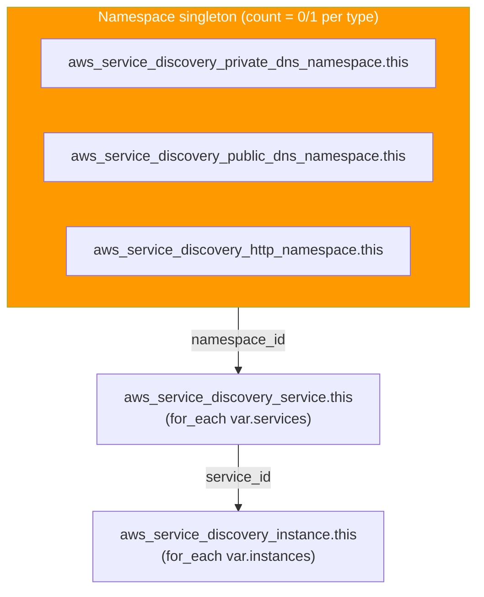

# 🟧 AWS **Service Discovery (Cloud Map)** Terraform Module

> **A secure-by-default AWS Cloud Map module** — one namespace (PRIVATE_DNS, PUBLIC_DNS, or HTTP),
> its services, and their registered instances, in a single composite call. Built for the AWS
> provider **v6.x**.


---

## 🧩 Overview

- 🗺️ Creates **one AWS Cloud Map namespace** per module call — `PRIVATE_DNS` (VPC-scoped DNS),
 `PUBLIC_DNS` (internet-resolvable DNS), or `HTTP` (API-only discovery, the shape ECS Service
 Connect uses) — selected by `namespace_type`.
- 🧭 Registers **0..N services** under that namespace (`aws_service_discovery_service`), each with
 its own DNS record shape, routing policy, and optional health check.
- 📍 Registers **0..N service-registry instances** (`aws_service_discovery_instance`) — concrete
 endpoints (an IP, a port, an EC2/ECS identifier) advertised under a service.
- 🔒 Defaults service destroy to the safe posture (`force_destroy = false`) so a live-instance
 service fails loudly instead of silently deregistering endpoints.
- 🩺 Supports both Route-53-probed health checks (`health_check_config`, PUBLIC_DNS only) and
 application-reported health (`health_check_custom_config`) — the tradeoff is documented, not
 defaulted, in Design Principles.

> 💡 **Why it matters:** Cloud Map is the DNS/API backbone that lets ECS/EKS/EC2 workloads find
> each other without hard-coded IPs — and it is what `aws_ecs_service.service_registries` and ECS
> Service Connect both wire into.

---

## ❤️ Support this project

If these Terraform modules have been helpful to you or your organization, I'd appreciate your support in any of the following ways:

- ⭐ **Star this repository** to help others discover this Terraform module.
- 🤝 **Connect with me on LinkedIn:** [linkedin.com/in/microsoftexpert](https://www.linkedin.com/in/microsoftexpert)
- ☕ **Buy me a coffee:** [buymeacoffee.com/microsoftexpert](https://buymeacoffee.com/microsoftexpert)

Whether it's a star, a professional connection, or a coffee, every gesture helps keep these modules actively maintained and continually improving. Thank you for being part of the community!

---

## 🗺️ Where this fits in the family



---

## 🧬 What this module builds



> Both diagrams were validated and rendered via the Mermaid Chart MCP (`validate_and_render_mermaid_diagram`) — `valid: true` for each.

---

## ✅ Provider / Versions

| Requirement | Version |
|---|---|
| Terraform | `>= 1.12.0` |
| `hashicorp/aws` provider | `>= 6.0, < 7.0` |

---

## 🔑 Required IAM Permissions

| Action | Required for | Notes |
|---|---|---|
| `servicediscovery:CreateHttpNamespace` / `CreatePrivateDnsNamespace` / `CreatePublicDnsNamespace` | Namespace creation | Only the action matching `namespace_type` is actually exercised |
| `servicediscovery:GetNamespace`, `ListNamespaces` | Read-back / drift detection | — |
| `servicediscovery:DeleteNamespace` | Namespace destroy | — |
| `servicediscovery:CreateService`, `GetService`, `UpdateService`, `DeleteService`, `ListServices` | Service lifecycle (`var.services`) | — |
| `servicediscovery:RegisterInstance`, `GetInstance`, `DeregisterInstance`, `ListInstances` | Instance lifecycle (`var.instances`) | — |
| `servicediscovery:TagResource`, `UntagResource`, `ListTagsForResource` | Tag management | — |
| `route53:CreateHostedZone`, `GetHostedZone`, `ListHostedZonesByName`, `DeleteHostedZone` | Hidden hosted zone Cloud Map auto-manages for PRIVATE_DNS/PUBLIC_DNS namespaces | Cloud Map calls these on your behalf — no `aws_route53_zone` resource exists in this module |
| `ec2:DescribeVpcs`, `DescribeRegions` | VPC validation on PRIVATE_DNS namespace creation | — |

No service-linked role is auto-created by Cloud Map itself, and no `iam:PassRole` is required.

---

## 📋 AWS Prerequisites

- **PRIVATE_DNS namespaces auto-create a *private* Route 53 hosted zone** tied to `vpc_id`; deleting
 the namespace deletes that zone. Don't also stand up an `aws_route53_zone` for the same domain
 against the same VPC.
- **PUBLIC_DNS namespaces auto-create a *public* Route 53 hosted zone** — no `us-east-1` constraint
 applies to Cloud Map itself (unlike CloudFront/ACM/WAFv2).
- The VPC behind a PRIVATE_DNS namespace must have **`enable_dns_support` and `enable_dns_hostnames`
 set to `true`**.
- **ECS Service Connect** consumes an `HTTP` namespace as its shared namespace — this module is the
 correct source for that namespace.
- **Quotas** (soft, raisable): 100 namespaces/account/Region, 6,000 services/account/Region, 400,000
 registered instances/account/Region. Large ECS estates should watch the service/instance quotas.

---

## 📁 Module Structure

```
tf-mod-aws-service-discovery/
├── providers.tf
├── variables.tf
├── main.tf
├── outputs.tf
├── README.md
└── SCOPE.md
```

---

## ⚙️ Quick Start

```hcl
module "vpc" {
  source = "git::https://github.com/microsoftexpert/tf-mod-aws-vpc?ref=v1.0.0"
  #...
}

module "service_discovery" {
  source = "git::https://github.com/microsoftexpert/tf-mod-aws-service-discovery?ref=v1.0.0"

  namespace_name = "internal.local"
  namespace_type = "PRIVATE_DNS"
  vpc_id         = module.vpc.id

  services = {
    orders-api = {
      dns_config = {
        dns_records = [{ type = "A", ttl = 10 }]
      }
    }
  }

  tags = {
    environment = "prod"
    workload    = "orders"
  }
}
```

---

## 🔌 Cross-Module Contract

### Consumes
| Input | Type | Source module |
|---|---|---|
| `vpc_id` | `string` (`vpc-xxxxxxxx`) | `tf-mod-aws-vpc` (required only when `namespace_type = PRIVATE_DNS`) |

### Emits
| Output | Description | Consumed by |
|---|---|---|
| `id` | Active namespace id | Anything that needs the raw namespace id (e.g. ECS Service Connect config) |
| `arn` | Active namespace ARN | IAM policies scoping `servicediscovery:*` |
| `name` | Namespace name | Documentation / DNS composition |
| `namespace_type` | Which type this instance created | Conditional wiring in calling code |
| `hosted_zone_id` | Auto-created Route 53 zone id (null for HTTP) | Read-only lookups against the hidden zone |
| `http_name` | HTTP namespace's reported name (null unless HTTP) | Debug/verification |
| `service_ids` | Map: services key -> service id | Debug/verification |
| `service_arns` | Map: services key -> service ARN | `tf-mod-aws-ecs-service` `service_registries` block |
| `service_names` | Map: services key -> rendered service name | Documentation |
| `instance_ids` | Map: instances key -> instance id | Debug/verification |
| `tags_all` | All tags incl. provider `default_tags` | Governance/audit |

---

## 📚 Example Library

<details><summary><strong>1 · Minimal PRIVATE_DNS namespace, no services</strong></summary>

```hcl
module "service_discovery" {
  source = "git::https://github.com/microsoftexpert/tf-mod-aws-service-discovery?ref=v1.0.0"

  namespace_name = "internal.local"
  namespace_type = "PRIVATE_DNS"
  vpc_id         = module.vpc.id
}
```
</details>

<details><summary><strong>2 · PRIVATE_DNS namespace with a single A-record service</strong></summary>

```hcl
module "service_discovery" {
  source = "git::https://github.com/microsoftexpert/tf-mod-aws-service-discovery?ref=v1.0.0"

  namespace_name = "internal.local"
  namespace_type = "PRIVATE_DNS"
  vpc_id         = module.vpc.id

  services = {
    web = {
      dns_config = {
        dns_records = [{ type = "A", ttl = 10 }]
      }
    }
  }
}
```
</details>

<details><summary><strong>3 · PUBLIC_DNS namespace with a health-checked service</strong></summary>

```hcl
module "service_discovery" {
  source = "git::https://github.com/microsoftexpert/tf-mod-aws-service-discovery?ref=v1.0.0"

  namespace_name = "svc.example.com"
  namespace_type = "PUBLIC_DNS"

  services = {
    api = {
      dns_config = {
        dns_records = [{ type = "A", ttl = 10 }]
      }
      health_check_config = {
        type              = "HTTPS"
        resource_path     = "/healthz"
        failure_threshold = 3
      }
    }
  }
}
```
> `health_check_config` is only legal under a `PUBLIC_DNS` namespace — the module's variable
> validation rejects it under `PRIVATE_DNS`/`HTTP`.
</details>

<details><summary><strong>4 · HTTP namespace for ECS Service Connect</strong></summary>

```hcl
module "service_discovery" {
  source = "git::https://github.com/microsoftexpert/tf-mod-aws-service-discovery?ref=v1.0.0"

  namespace_name = "my-cluster"
  namespace_type = "HTTP"

  services = {
    orders = {
      discovery_type = "HTTP" # DiscoverInstances only — no DNS record
    }
  }
}
```
</details>

<details><summary><strong>5 · Custom (application-reported) health check under PRIVATE_DNS</strong></summary>

```hcl
module "service_discovery" {
  source = "git::https://github.com/microsoftexpert/tf-mod-aws-service-discovery?ref=v1.0.0"

  namespace_name = "internal.local"
  namespace_type = "PRIVATE_DNS"
  vpc_id         = module.vpc.id

  services = {
    orders-api = {
      dns_config = {
        dns_records = [{ type = "A", ttl = 10 }]
      }
      # PUBLIC_DNS-only health_check_config is not legal here — use the
      # app-reported signal instead (UpdateInstanceCustomHealthStatus).
      health_check_custom_config = {
        failure_threshold = 1
      }
    }
  }
}
```
> ⚠️ `health_check_custom_config` is deprecated upstream in the `hashicorp/aws` provider in favor of
> `health_check_config` — but `health_check_config` is not legal outside `PUBLIC_DNS`, so this remains
> the only first-party health-check option for private/internal services. See Design Principles.
</details>

<details><summary><strong>6 · WEIGHTED routing policy across two record sets</strong></summary>

```hcl
module "service_discovery" {
  source = "git::https://github.com/microsoftexpert/tf-mod-aws-service-discovery?ref=v1.0.0"

  namespace_name = "internal.local"
  namespace_type = "PRIVATE_DNS"
  vpc_id         = module.vpc.id

  services = {
    canary-api = {
      dns_config = {
        routing_policy = "WEIGHTED"
        dns_records    = [{ type = "A", ttl = 10 }]
      }
    }
  }
}
```
</details>

<details><summary><strong>7 · Registering instances against a service</strong></summary>

```hcl
module "service_discovery" {
  source = "git::https://github.com/microsoftexpert/tf-mod-aws-service-discovery?ref=v1.0.0"

  namespace_name = "internal.local"
  namespace_type = "PRIVATE_DNS"
  vpc_id         = module.vpc.id

  services = {
    web = {
      dns_config = { dns_records = [{ type = "A", ttl = 10 }] }
    }
  }

  instances = {
    web-1a = {
      service_key = "web"
      attributes  = { AWS_INSTANCE_IPV4 = "10.0.1.10", AWS_INSTANCE_PORT = "8080" }
    }
    web-1b = {
      service_key = "web"
      attributes  = { AWS_INSTANCE_IPV4 = "10.0.1.11", AWS_INSTANCE_PORT = "8080" }
    }
  }
}
```
</details>

<details><summary><strong>8 · `for_each` pattern — one namespace per environment</strong></summary>

```hcl
locals {
  environments = {
    dev  = { vpc_id = module.vpc_dev.id }
    prod = { vpc_id = module.vpc_prod.id }
  }
}

module "service_discovery" {
  source   = "git::https://github.com/microsoftexpert/tf-mod-aws-service-discovery?ref=v1.0.0"
  for_each = local.environments

  namespace_name = "internal.${each.key}.local"
  namespace_type = "PRIVATE_DNS"
  vpc_id         = each.value.vpc_id
}
```
</details>

<details><summary><strong>9 · `tags` example — merging with provider `default_tags`</strong></summary>

```hcl
# Root provider block (not part of this module):
# provider "aws" {
# default_tags {
# tags = { managed-by = "terraform", cost-center = "platform" }
# }
# }

module "service_discovery" {
  source = "git::https://github.com/microsoftexpert/tf-mod-aws-service-discovery?ref=v1.0.0"

  namespace_name = "internal.local"
  namespace_type = "PRIVATE_DNS"
  vpc_id         = module.vpc.id

  tags = {
    environment = "prod"
    owner       = "platform-team"
    # A key collision with a provider default_tags key (e.g. "managed-by")
    # would resolve in favor of THIS map — resource tags win.
  }
}

output "tags_all" {
  value = module.service_discovery.tags_all
}
```
</details>

<details><summary><strong>10 · Secure-by-default opt-out — allow destroying a service with live instances</strong></summary>

```hcl
module "service_discovery" {
  source = "git::https://github.com/microsoftexpert/tf-mod-aws-service-discovery?ref=v1.0.0"

  namespace_name = "internal.local"
  namespace_type = "PRIVATE_DNS"
  vpc_id         = module.vpc.id

  services = {
    scratch = {
      dns_config    = { dns_records = [{ type = "A", ttl = 10 }] }
      force_destroy = true # opt-out: allows `terraform destroy` to deregister live instances
    }
  }
}
```
> Default is `force_destroy = false` — a destroy fails loudly rather than silently dropping live
> endpoints. Only flip this for throwaway/test services.
</details>

<details><summary><strong>11 · `import` block — adopting an existing namespace</strong></summary>

```hcl
import {
  to = module.service_discovery.aws_service_discovery_private_dns_namespace.this[0]
  id = "ns-abc123456789:vpc-0abc123456"
}
```
</details>

<details><summary><strong>12 · End-to-end composition — VPC + Cloud Map + ECS service</strong></summary>

```hcl
module "vpc" {
  source = "git::https://github.com/microsoftexpert/tf-mod-aws-vpc?ref=v1.0.0"
  #...
}

module "service_discovery" {
  source = "git::https://github.com/microsoftexpert/tf-mod-aws-service-discovery?ref=v1.0.0"

  namespace_name = "internal.local"
  namespace_type = "PRIVATE_DNS"
  vpc_id         = module.vpc.id

  services = {
    orders-api = {
      dns_config = {
        dns_records = [{ type = "A", ttl = 10 }]
      }
      health_check_custom_config = { failure_threshold = 1 }
    }
  }
}

module "ecs_service" {
  source = "git::https://github.com/microsoftexpert/tf-mod-aws-ecs-service?ref=v1.0.0"

  #...
  service_registries = {
    registry_arn = module.service_discovery.service_arns["orders-api"]
  }
}
```
</details>

---

## 📥 Inputs

**Core**
- `namespace_name` — the namespace's name (FORCE-NEW)
- `namespace_type` — `PRIVATE_DNS` / `PUBLIC_DNS` / `HTTP` (FORCE-NEW in effect)
- `vpc_id` — required (and only legal) when `namespace_type = PRIVATE_DNS`
- `description` — free-text namespace description

**Services**
- `services` — map of `aws_service_discovery_service` definitions (`name`, `description`,
 `force_destroy`, `discovery_type`, `dns_config`, `health_check_config`,
 `health_check_custom_config`, `tags`)

**Instances**
- `instances` — map of `aws_service_discovery_instance` registrations (`service_key`,
 `instance_id`, `attributes`)

**Tags**
- `tags` — applied to the namespace and every service

---

## 🧾 Outputs

- `id`, `arn` — the active namespace's id/ARN
- `name`, `namespace_type` — namespace name and the type this instance created
- `hosted_zone_id` — auto-created Route 53 zone id (`null` for HTTP)
- `http_name` — HTTP namespace's reported name (`null` unless HTTP)
- `service_ids`, `service_arns`, `service_names` — maps keyed by `services` key
- `instance_ids` — map keyed by `instances` key
- `tags_all` — merged tag set including provider `default_tags`

No output in this module is `sensitive = true` — Cloud Map resources carry no secrets.

---

## 🧠 Architecture Notes

- **ARN format:** `arn:aws:servicediscovery:<region>:<account-id>:namespace/<namespace-id>` for
 namespaces; services carry their own `arn:aws:servicediscovery:...:service/<service-id>`.
- **Immutable fields:** `namespace_name`, `namespace_type` (in effect — see below), `vpc_id`,
 `services[*].name`, `dns_config.namespace_id`, `dns_config.dns_records[*].type`,
 `health_check_config.type`, and all of `health_check_custom_config` are effectively force-new —
 Cloud Map's Update APIs don't cover them.
- **`namespace_type` is force-new in effect, not by a single schema flag** — this module renders
 three mutually-exclusive `count`-gated resources, so switching types always means "destroy one
 resource, create a different one," which Terraform will show as a replace+create pair, not an
 in-place update.
- **`tags` ↔ `tags_all` ↔ provider `default_tags`:** resource tags always win on key conflict; the
 computed `tags_all` output reflects the merge. `aws_service_discovery_instance` is not taggable.
- **No `timeouts` variable.** Verified against the live `hashicorp/aws` v6.54.0 schema
 (`terraform providers schema -json`): none of the five resources in this module expose a
 `timeouts {}` block. See SCOPE.md "Provider gotchas" for the full justification.
- **Destroy ordering:** instances → services → namespace. Terraform's dependency graph handles this
 automatically for resources declared inside this module call; instances registered *outside*
 Terraform (e.g. auto-registered by ECS Service Connect) will block a service/namespace destroy
 unless `force_destroy = true` is set or they are deregistered first.
- **No `us-east-1` global-resource requirement** — Cloud Map namespaces are regional; this is unlike
 CloudFront/ACM-for-CloudFront/WAFv2-CLOUDFRONT.

---

## 🧱 Design Principles

- **One namespace per module call**, chosen via `count`-gated singletons rather than a `for_each`
 over namespace type — matches how Cloud Map is actually used (one namespace per
 environment/cluster) and avoids a single call accidentally creating two colliding namespaces.
- **Service destroy safety is opt-out, not opt-in:** `force_destroy` defaults to `false` on every
 service. Flip `services[*].force_destroy = true` only for throwaway/test services.
- **Health-check signal choice is documented, not defaulted:** the module does not silently prefer
 `health_check_config` (unauthenticated Route 53 probe, PUBLIC_DNS-only, current upstream
 recommendation) over `health_check_custom_config` (app-reported, no network probe, deprecated
 upstream but the only option under PRIVATE_DNS/HTTP). Pick the block that matches your posture —
 see SCOPE.md "Secure-by-default decisions" for the full tradeoff.
- **`instances[*].service_key` is validated at plan time** against `keys(var.services)`, turning a
 typo'd reference into a clear `validation` error instead of an opaque `for_each` index crash.
- **VPC scoping is enforced by variable validation**, not a runtime check: `vpc_id` is required
 exactly when `namespace_type = PRIVATE_DNS` and forbidden otherwise.

---

## 🚀 Runbook

```powershell
cd C:\GitHubCode\newawsmodules\tf-mod-aws-service-discovery
terraform init -backend=false
terraform validate
terraform fmt -check
```

> ⚠️ `terraform plan`/`terraform apply` require valid AWS credentials (profile / SSO / OIDC) and a
> configured region — this module has none of its own. Always pin the module source with
> `?ref=v1.0.0`, never a floating branch.

---

## 🧪 Testing

- `terraform init -backend=false`, `terraform validate`, and `terraform fmt -check` all pass with
 zero errors against `hashicorp/aws` v6.54.0.
- No live `plan`/`apply` was run as part of authoring this module (per this suite's
 plan-only discipline; an accountable human runs `apply` outside this workflow).

---

## 💬 Example Output

```
$ terraform apply

 # module.service_discovery.aws_service_discovery_private_dns_namespace.this[0] will be created
 # module.service_discovery.aws_service_discovery_service.this["orders-api"] will be created

Outputs:

id = "ns-abc123456789"
arn = "arn:aws:servicediscovery:us-east-2:123456789012:namespace/ns-abc123456789"
namespace_type = "PRIVATE_DNS"
hosted_zone_id = "Z0123456789ABCDEF"
service_arns = {
 "orders-api" = "arn:aws:servicediscovery:us-east-2:123456789012:service/srv-abc123456789"
}
```

---

## 🔍 Troubleshooting

- **Tag drift from `default_tags` overlap** — duplicate the same key in both the provider
 `default_tags` block and this module's `tags` and you'll see perpetual plan diffs; check the merged
 result in the `tags_all` output rather than guessing.
- **Credential-chain failures on `plan`/`apply`** — this module has no credential inputs; confirm
 `AWS_PROFILE`/SSO session/OIDC role is active in the shell/pipeline before blaming the module.
- **`health_check_config` rejected by variable validation** — you set it on a service under a
 `PRIVATE_DNS` or `HTTP` namespace; AWS only supports Route-53-probed health checks under
 `PUBLIC_DNS`. Switch to `health_check_custom_config`, or drop health checking for HTTP-namespace
 services (they have no DNS record to probe anyway).
- **`dns_config` rejected under an HTTP namespace** — HTTP-namespace services are discovered via
 `DiscoverInstances` only; set `discovery_type = "HTTP"` instead and omit `dns_config`.
- **IAM `AccessDenied` on apply** — cross-check the failing action against SCOPE.md's `## Required
 IAM permissions`; a common miss is the `route53:*` actions Cloud Map calls on your behalf for the
 hidden hosted zone, not just `servicediscovery:*`.
- **Destroy hangs on "instances still registered"** — a service still has live
 `aws_service_discovery_instance` resources (possibly registered outside Terraform, e.g. by ECS
 Service Connect). Deregister them or set `services[*].force_destroy = true` before destroying.
- **`instances[*].service_key` validation error** — the key you referenced isn't present in
 `var.services`; check for a typo or an environment-conditional service that didn't get created.

---

## 🔗 Related Docs

- Terraform Registry: `aws_service_discovery_private_dns_namespace` resource reference
- Terraform Registry: `aws_service_discovery_public_dns_namespace` resource reference
- Terraform Registry: `aws_service_discovery_http_namespace` resource reference
- Terraform Registry: `aws_service_discovery_service` resource reference
- Terraform Registry: `aws_service_discovery_instance` resource reference
- AWS Cloud Map Developer Guide — namespaces, services, and instances
- AWS Cloud Map RegisterInstance API reference — supported instance attribute keys
- Amazon ECS Developer Guide — Service Discovery and Service Connect

---

> 🧡 *"Infrastructure as Code should be standardized, consistent, and secure."*
